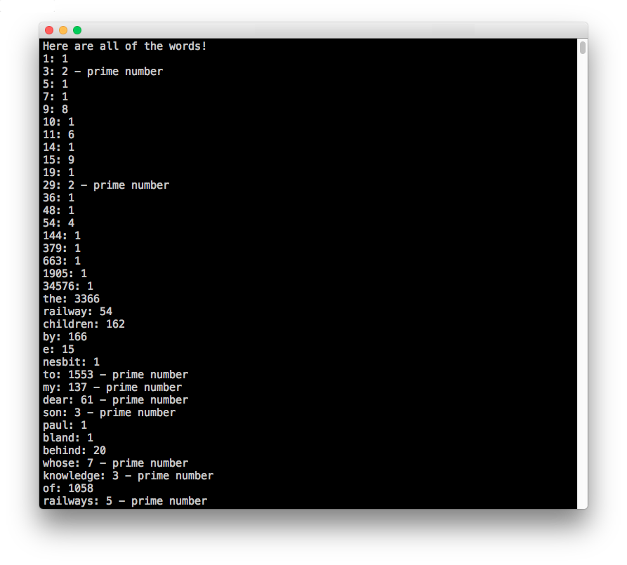
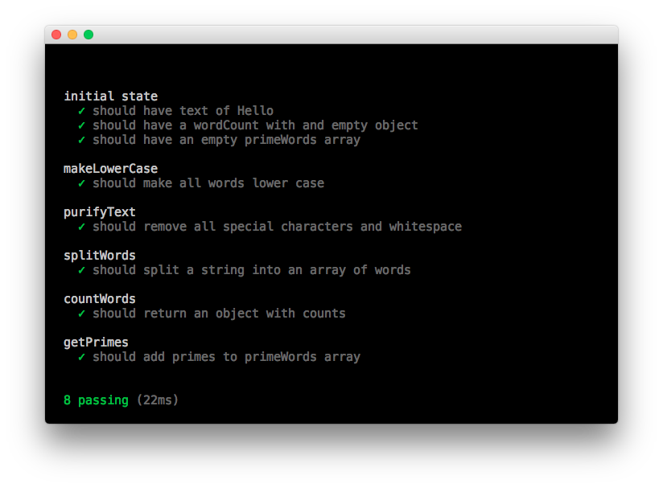

# Wordcounter (in NodeJS)


A few months ago, I built an application in JavaScript in the front-end that allows you to upload a txt file, count all the words and see which of those counts is a prime number. You can view it [here](https://github.com/freddyfallon/words-in-a-book).

This application takes another shot at the same problem, but uses NodeJS and ES6 syntax instead.

## How to run

- Clone the repo with:
```
git clone https://github.com/freddyfallon/wordcounter
```

- You will need to grab all of the npm modules used by this project:

```
npm install
```

- Then, to see it in action:

```
npm start
```

- As the application logs quite a bit of text to the screen, you might also want to set your terminal to allow unlimited scrollback, but that's up to you

## How to run tests

This application is tested using Mocha and Chai, and you can easily run the tests by using:

```
npm test
```



You will see here that the tests all pass.

# Reviewing my previous attempt

I had a look through the code in my previous effort, and noted the following:

- There is a lot of code, probably way too much
- I have tried to separate concerns but the whole thing just became convoluted
- I ran it in the browser, using Express, but this actually added more complication to a relatively simple task

# My approach

Since completing my previous effort, I have learnt a lot about NodeJS. I think the main reason I didn't use it before was because I had such limited experience with it. I now feel comfortable with NodeJS (and ES6 syntax), and wanted to have a go at solving this challenge with it.

My main goal when writing this application was to write as little code as possible, while still meeting the requirements.

I made the decision not to split that application into multiple ES6 classes, the reason being that I felt it was simple enough to solve with a small amount of code.

# Successes

I think the main success here was the speed in which I managed to complete this. My first attempt at this challenge took me three days, while I managed to complete this application in three hours instead.

My other big success here was around writing far less code to solve the same problem. This was more down to the choice of NodeJS instead of front-end JavaScript.

I also really enjoyed using ES6 syntax and even promises (with the help of a node module).

# Challenges

My only challenge here was around testing things being written to the console. This is something that can be done in Sinon, but I decided to leave this for another day!

I also used a few npm modules here (like lodash) to make life easier for me. Particularly around iterating over items within an object. Maybe I should have done things the old fashioned way here.
